<div align="center">



<br>

<a href="#what-is-saira"><b>About</b></a> &nbsp;&middot;&nbsp;
<a href="#architecture"><b>Architecture</b></a> &nbsp;&middot;&nbsp;
<a href="#evaluation-metrics"><b>Metrics</b></a> &nbsp;&middot;&nbsp;
<a href="#shadow-testing"><b>Shadow Testing</b></a>

<br><br>


<br>


<a href="LICENSE"></a>

<a href="README.md"></a>
<a href="README.ru.md"></a>

</div>

---

## What is SAIRA?

SAIRA is an automated quality assessment platform for AI agents in production. It collects telemetry from agent execution chains (LLM calls, tool calls, full sessions), analyzes them and evaluates correctness, efficiency and cost — without manual review.

### Core Capabilities

- **Ingestion** — accepts data via REST API and Apache Kafka in OpenTelemetry format (GenAI semantic conventions)
- **Agent Trace Analysis** — reconstructs the full agent execution chain from spans: LLM calls, tool calls, intermediate steps
- **LLM as Judge** — automated quality assessment of LLM responses and tool calls using [spring-ai-ragas](https://github.com/ai-qa-solutions/spring-ai-ragas)
- **Shadow Testing** — duplicates agent requests to alternative models and tool versions for A/B comparison without affecting production
- **Evaluation Dashboard** — visual panel with metrics, trends and drill-down by agent sessions

## Tech Stack

| Layer | Technology |
|-------|-----------|
| Backend | Java 21, Spring Boot 3.5.11, Spring WebMVC |
| Data | PostgreSQL 16, Spring Data JPA, Flyway |
| Messaging | Apache Kafka, Spring Kafka |
| Evaluation | spring-ai-ragas 0.3.1 (LLM as Judge, NLP metrics, agent metrics) |
| Frontend | React 19, TypeScript, Vite, Tailwind CSS 4, shadcn/ui |
| Infrastructure | Docker / Podman, docker-compose |

## Architecture

```
                    ┌─────────────────┐
                    │   AI Agents     │
                    │  (Production)   │
                    └────────┬────────┘
                             │ OTel spans (gen_ai.*, saira.*)
                    ┌────────┴────────┐
              ┌─────┤   Ingestion     ├─────┐
              │     └─────────────────┘     │
         REST API                      Kafka Consumer
              │                             │
              └──────────┬──────────────────┘
                         │
                ┌────────▼────────┐
                │  Trace Builder  │
                │  (Agent Chain   │
                │   Reconstruction)│
                └────────┬────────┘
                         │
           ┌─────────────┼─────────────┐
           │             │             │
    ┌──────▼──────┐ ┌────▼─────┐ ┌────▼──────┐
    │ LLM as Judge│ │  Shadow  │ │   NLP     │
    │ (spring-ai- │ │  Calls   │ │  Metrics  │
    │  ragas)     │ │          │ │           │
    └──────┬──────┘ └────┬─────┘ └────┬──────┘
           │             │             │
           └─────────────┼─────────────┘
                         │
                ┌────────▼────────┐
                │   PostgreSQL    │
                │   (Results &    │
                │    Analytics)   │
                └────────┬────────┘
                         │
                ┌────────▼────────┐
                │   Dashboard     │
                │  (React SPA)    │
                └─────────────────┘
```

## Evaluation Metrics

SAIRA uses [spring-ai-ragas](https://github.com/ai-qa-solutions/spring-ai-ragas) for comprehensive evaluation:

| Category | Metrics | LLM Required |
|----------|---------|:---:|
| **General Purpose** | AspectCritic, SimpleCriteriaScore, RubricsScore | Yes |
| **Agent** | AgentGoalAccuracy, ToolCallAccuracy, TopicAdherence | Partial |
| **Retrieval** | Faithfulness, ContextPrecision, ContextRecall, ResponseRelevancy | Yes |
| **Response Quality** | AnswerCorrectness, FactualCorrectness, SemanticSimilarity | Partial |
| **NLP (Deterministic)** | BLEU, ROUGE, chrF, StringSimilarity | No |

### With vs Without References

| Mode | Use Case | Metrics |
|------|----------|---------|
| **With references** | Regression tests, synthetic monitoring | Full set (~8 LLM calls) |
| **Without references** | Production traffic sampling | Subset (~6 LLM calls + embeddings) |

## Shadow Testing

Shadow testing allows evaluating alternative models and configurations without affecting production:

1. SAIRA intercepts agent requests from telemetry
2. Duplicates requests to selected alternative models / tool versions
3. Evaluates and compares results across all metrics
4. Displays A/B comparison in the dashboard

**Result**: zero-cost verification of new model and tool versions before migration.

## License

[MIT](LICENSE)

---

Built with [spring-ai-ragas](https://github.com/ai-qa-solutions/spring-ai-ragas) for AI evaluation.
